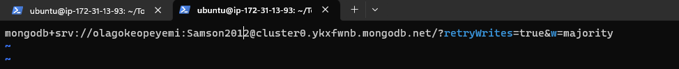

## **Documentation for Project 3**

### Nodejs and nodepm Installation 

`sudo apt update`

`sudo apt upgrade`

`sudo apt-get install -y nodejs`

`node -v`

`npm -v`

### Creating todo directory and initializing todo
`mkdir Todo`

`npm init`

### Installing Express.JS and dotenv
`npm install express`

`touch index.js`

`npm install dotenv`

`vim index.js`

`node index.js`

### Creating Model for our Application

`mkdir routes`

`cd routes`

`touch api.js`

### Mongoose Installation and creating Models Directory
`npm install mongoose`

`mkdir models`
`cd models`

`touch todo.js`

`mkdir models && cd models && touch todo.js`

`vim todo.js`

`vim api.js`

#### MongoDb Connected Successfully
`node index.js`

#### Database Populated with Entries 

### Frontend Creation
` npx create-react-app client`

` npm install concurrently --save-dev`

`npm install nodemon --save-dev`

`vi package.json`

`npm run dev`
#### Creating React App

#### React App running on Port 3000
`touch Input.js ListTodo.js Todo.js`

`vi input.js`

#### Axios Installation
` npm install axios`

// forgot to screenshot other commands due to errors encountered
#### Todo Running in Browser
`vi ListTodo.js`

`vi Todo.js`

`vi App.js`

`vi App.css`

`vim index.css`

`npm run dev`

